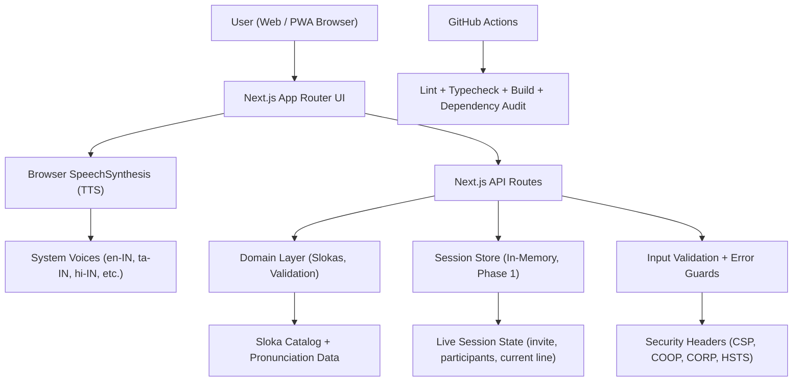

This is the Sloka Sabha web application built with [Next.js](https://nextjs.org).

## Getting Started

Install dependencies and run the development server:

```bash
npm ci
npm run dev
```

Open [http://127.0.0.1:3000](http://127.0.0.1:3000) with your browser.

Do not open `out/index.html` or `mobile-web/index.html` directly for the web app. Those files are fallback shells and will not include the real Next.js CSS, fonts, API routes, or generated asset bundles. A teammate should run the app with `npm ci` and `npm run dev`, or open the deployed URL.

Images, audio, video, decorative SVGs, and app fonts are served by the Next.js app from the repository. Public assets live in `public/`, and bundled fonts are configured in `app/layout.tsx`.

If the page appears plain or unstyled, run:

```bash
npm run doctor
```

This starts the local app and verifies that the Next.js CSS bundle, Shiva image, and hero video are being served. If this passes, the repo is healthy and the issue is usually that the app was opened from a static HTML file or an old/cached URL instead of the local Next.js server.

### One-command local bootstrap

If you want a teammate-friendly setup after cloning the repo, use the bootstrap script for your platform.

macOS / Linux:

```bash
bash scripts/bootstrap-dev.sh
```

Windows PowerShell:

```powershell
powershell -ExecutionPolicy Bypass -File .\scripts\bootstrap-dev.ps1
```

What the scripts do:

1. Check for Node.js 20+ and npm
2. Try to install Node.js automatically using the platform package manager
3. Run `npm ci`
4. Run `npm run lint` and `npm run typecheck`
5. Start the app locally

Optional environment variables:

```bash
HOST=127.0.0.1
PORT=3000
SKIP_QUALITY_CHECKS=1
```

Use `SKIP_QUALITY_CHECKS=1` only when you need the app running quickly and do not want lint/typecheck to block startup.

## Android APK Build (Capacitor)

This repo now includes a Capacitor Android wrapper in `android/`.

Because this app uses Next.js API routes, Android should load your deployed web app URL.

1. Deploy the web app (for example on Vercel) and copy the HTTPS URL.
2. Set the URL for Capacitor sync:

```bash
$env:CAPACITOR_APP_URL="https://your-deployed-app-url"
npm run android:sync
```

3. Open native project:

```bash
npm run android:open
```

4. In Android Studio, build APK:
`Build -> Build Bundle(s) / APK(s) -> Build APK(s)`

### Prerequisites

1. Android Studio (latest stable)
2. Android SDK + Platform Tools
3. Java 17 (required by modern Android Gradle toolchains)

If `CAPACITOR_APP_URL` is not set, the app uses a local fallback page from `mobile-web/index.html`.

## Architecture Overview



Detailed architecture notes are in `docs/ARCHITECTURE.md`.

## Quality And Security Commands

```bash
npm run lint
npm run typecheck
npm run build
npm run audit:deps
```

## Project Security Baseline

1. Secure SDLC process: `docs/sdlc/SECURE_SDLC.md`
2. OWASP control mapping: `docs/security/OWASP_TOP10_MAPPING.md`
3. Threat model: `docs/security/THREAT_MODEL.md`
4. Secure coding checklist: `docs/security/SECURE_CODING_CHECKLIST.md`
5. Reporting policy: `SECURITY.md`

## CI Workflows

1. `.github/workflows/ci.yml` runs lint, typecheck, and build.
2. `.github/workflows/security.yml` runs dependency audit on PRs and weekly schedule.

## Turbopack Panic Recovery (Windows)

If you see a fatal Turbopack panic log, use webpack mode:

```bash
npm run dev
```

Optional Turbopack run:

```bash
npm run dev:turbo
```

If panic continues:

1. Stop all Node processes.
2. Delete `.next`.
3. Run `npm ci`.
4. Run `npm run dev`.

## Next Steps

1. Add Supabase project and environment variables from `.env.example`.
2. Implement auth and row-level security before handling real user data.
3. Add API route validation for each write endpoint.
