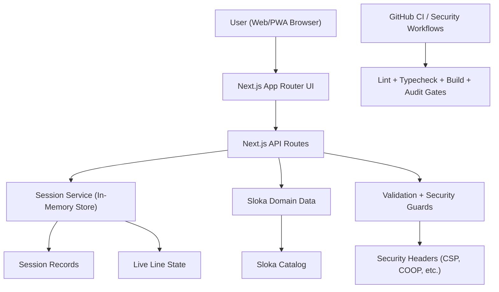

# Architecture Diagram

## Current Runtime Layers

1. Presentation:
`components/AppClient.tsx`, `app/page.tsx`, `app/globals.css`

2. API:
`app/api/*`

3. Domain:
`lib/domain/*`

4. Server State:
`lib/server/session-store.ts`

## Next Planned Evolution

1. Replace in-memory session store with Supabase tables.
2. Add auth and role-aware policies (host, participant, admin).
3. Replace polling with Supabase Realtime subscriptions.
