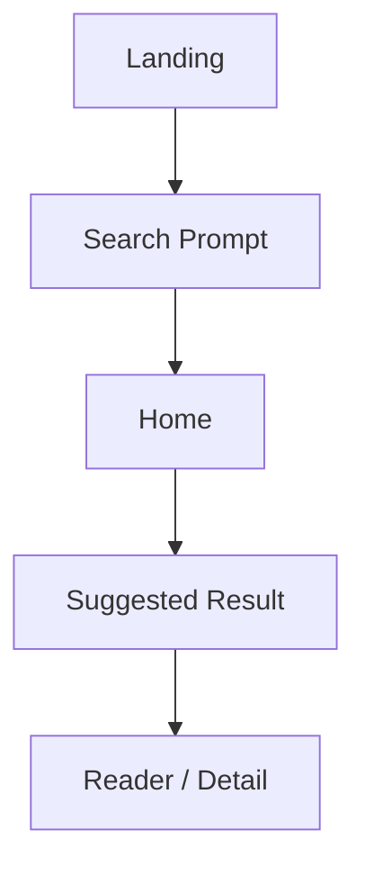
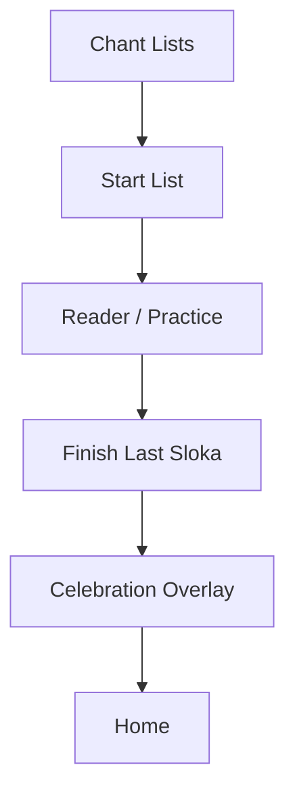
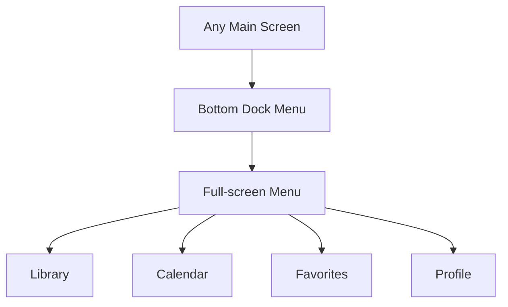

# Sloka Sabha Figma UI Handoff

This document converts the current app UI into a Figma-ready handoff package. It is meant to help with all three of these jobs:

1. Screen inventory and frame planning
2. Component and interaction handoff from the current code
3. Design tokens for recreating the app cleanly in Figma

Source of truth in code:

- `C:\Users\Viv\Documents\Codex\Project_APP\Project_APP_Web\components\AppClient.tsx`
- `C:\Users\Viv\Documents\Codex\Project_APP\Project_APP_Web\app\globals.css`

## 1. What We Have Today

The app is currently a single-page Next.js client app with route-style conditional rendering inside one component. The main product areas already present are:

- Landing screen
- Home
- Browse by Gods
- Panchangam / Tamil Calendar
- Sessions
- Chant Lists
- Library
- Favorites
- Profile
- Sloka Detail / Reader / Practice screen
- Bottom dock
- Full-screen menu overlay
- Chant completion celebration overlay

### Current screen anchors in code

- Landing: `AppClient.tsx:1286`
- Home: `AppClient.tsx:1424`
- Gods: `AppClient.tsx:1651`
- Calendar: `AppClient.tsx:1747`
- Sessions: `AppClient.tsx:1847`
- Chant Lists: `AppClient.tsx:2061`
- Library: `AppClient.tsx:2190`
- Favorites: `AppClient.tsx:2255`
- Profile: `AppClient.tsx:2314`
- Detail / reader screen: `AppClient.tsx:2354`
- Bottom dock: `AppClient.tsx:2483`
- Menu overlay: `AppClient.tsx:2496`
- Celebration overlay: `AppClient.tsx:1258`

## 2. Figma File Structure

Recommended Figma pages:

1. `00 Foundations`
2. `01 Components`
3. `02 Mobile Screens`
4. `03 Flows`
5. `04 Notes / Dev Handoff`

Recommended mobile frame size:

- Base design frame: `390 x 844`

Optional secondary validation frame:

- `430 x 932`

## 3. Screen Inventory

### 3.1 Landing

Purpose:

- Entry into the app
- Brand impression
- Launch into sloka search flow

Main blocks:

- Full-screen background image/video
- Center CTA: `Enter Slokas`
- Search prompt modal / panel

Figma frame names:

- `Landing / Default`
- `Landing / Search Prompt Open`

### 3.2 Home

Purpose:

- Daily overview
- Fast restart into chanting
- Search and recommendations

Main blocks:

- App header / brand
- Search box
- Greeting card: `Namaste`
- Continue Journey card
- Start Chanting deity quick row
- Today in Tamil Calendar card
- Suggested Results or Search Results
- Popular Slokas
- Bottom dock

Current code anchors:

- `AppClient.tsx:1465` greeting
- `AppClient.tsx:1471` continue card
- `AppClient.tsx:1504` start chanting
- `AppClient.tsx:1535` Tamil calendar
- `AppClient.tsx:1569` suggested/search results
- `AppClient.tsx:1611` popular slokas

Figma frame names:

- `Home / Default`
- `Home / Search Active`
- `Home / Bottom Menu Open`

### 3.3 Browse by Gods

Purpose:

- Browse slokas by deity

Main blocks:

- Title
- Filter chips or deity section tabs
- Deity cards
- Sloka list section for selected deity

Current code anchors:

- `AppClient.tsx:1658`
- `AppClient.tsx:1716`

Figma frame names:

- `Gods / Grid`
- `Gods / Category Selected`

### 3.4 Panchangam / Calendar

Purpose:

- Today’s Tamil calendar context
- Festival and chanting recommendations
- Completion tracking

Main blocks:

- Header
- Today in Tamil Calendar summary
- Festival pills
- Daily details list
- Recommended slokas
- Completion calendar grid

Current code anchors:

- `AppClient.tsx:1754`
- `AppClient.tsx:1762`
- `AppClient.tsx:1828`

Figma frame names:

- `Calendar / Today`
- `Calendar / Completion Grid`

### 3.5 Sessions

Purpose:

- Focused chanting and progress

Current code anchor:

- `AppClient.tsx:1854`

Figma frame names:

- `Sessions / Overview`

### 3.6 Chant Lists

Purpose:

- Playlist-like sloka lists
- Schedule and notification setup
- Back-to-back chanting flow

Current code anchor:

- `AppClient.tsx:2068`

Main blocks:

- Create chant list form
- Existing chant lists
- Start list / edit / schedule controls

Figma frame names:

- `Chant Lists / Empty`
- `Chant Lists / Existing List`
- `Chant Lists / Completion Celebration`

### 3.7 Library

Purpose:

- Search all slokas
- Browse openable results

Current code anchor:

- `AppClient.tsx:2197`

Figma frame names:

- `Library / Default`
- `Library / Filtered`

### 3.8 Favorites

Purpose:

- Saved slokas list

Current code anchor:

- `AppClient.tsx:2262`

Figma frame names:

- `Favorites / Default`
- `Favorites / Empty`

### 3.9 Profile

Purpose:

- User stats and settings summary

Current code anchor:

- `AppClient.tsx:2321`

Figma frame names:

- `Profile / Default`

### 3.10 Sloka Detail / Reader / Practice

Purpose:

- Read sloka
- Switch language
- Track progress
- Highlight lines
- Start and finish practice

Current code anchor:

- `AppClient.tsx:2354`

Main blocks:

- Hero section with deity image / floral / ring
- Sloka title
- Divider motif
- Sloka lines
- Transliteration
- Meaning
- Practice tracker
- Start / Finish / Reset actions
- Highlight line actions

Figma frame names:

- `Reader / Default`
- `Reader / Tamil`
- `Reader / English`
- `Reader / Both`
- `Reader / Practice Active`
- `Reader / Highlight Action`

### 3.11 Full-screen Menu

Purpose:

- Global navigation

Current code anchors:

- `AppClient.tsx:2496`
- `globals.css:5529`

Figma frame names:

- `Menu / Full Screen`

### 3.12 Celebration Overlay

Purpose:

- Reward when chant list completes

Current code anchors:

- `AppClient.tsx:1258`
- `globals.css:1887`

Figma frame names:

- `Overlay / Chant Celebration`

## 4. Component Inventory

Create these as Figma components first.

### Global shell

- `Header / Brand`
- `Bottom Dock / 3 Items`
- `Menu Overlay / Full Screen`
- `Celebration Overlay`

### Inputs

- `Search Field`
- `Time Picker Field`
- `Select Field`
- `Segmented Filter Chip`

### Cards

- `Greeting Card`
- `Journey Progress Card`
- `Tamil Calendar Card`
- `Stat Card`
- `Sloka Result Card`
- `Deity Card`
- `Chant List Card`
- `Practice Tracker Card`

### Buttons

- `Primary Button`
- `Secondary Button`
- `Icon Button`
- `Dock Button`
- `Favorite Icon Button`
- `Chip Toggle`

### Reader-specific

- `Reader Hero`
- `Decorative Divider`
- `Sloka Line`
- `Highlighted Sloka Line`
- `Language Toggle`
- `Font Scale Toggle`
- `Practice Action Row`

## 5. Interaction Inventory

These are worth diagramming in Figma prototype mode.

### Flow A: Launch to reading

### Flow B: Chant list completion

### Flow C: Menu navigation

## 6. Foundations for Figma

## 6.1 Color Tokens

These are the current CSS root tokens already used in the app.

Source:

- `globals.css:1-11`

| Token | Value | Intended use |
|---|---:|---|
| `--ink` | `#1c1c1c` | primary text |
| `--muted` | `#6d6d6d` | secondary text |
| `--paper` | `#faf7f0` | app background |
| `--surface` | `#ffffff` | card surface |
| `--line` | `rgba(27, 94, 32, 0.16)` | borders |
| `--lotus` | `#2e7d32` | primary green |
| `--leaf` | `#1b5e20` | dark green |
| `--gold` | `#d4af37` | accent gold |
| `--sky` | `rgba(46, 125, 50, 0.12)` | soft fills |
| `--night` | `#1b5e20` | dark sections |
| `--night-line` | `rgba(27, 94, 32, 0.22)` | dark borders |

### Recommended Figma naming

- `Text / Primary`
- `Text / Secondary`
- `Background / App`
- `Background / Surface`
- `Border / Default`
- `Brand / Green`
- `Brand / Green Dark`
- `Accent / Gold`
- `Fill / Soft Green`

## 6.2 Typography

The current app uses two families:

- Serif for headings and devotional emphasis
- Sans for UI body and controls

Current code evidence:

- `globals.css:22-29`
- `globals.css:84-94`

### Recommended Figma styles

| Style | Family | Size | Weight | Use |
|---|---|---:|---:|---|
| `Display / 40` | Cambria / Times | 40 | 700 | hero headings |
| `Heading / 32` | Cambria / Times | 32 | 700 | page titles |
| `Heading / 24` | Cambria / Times | 24 | 700 | section titles |
| `Title / 20` | Cambria / Times | 20 | 700 | card titles |
| `Body / 16` | Trebuchet / Segoe UI | 16 | 400 | default body |
| `Body / 14` | Trebuchet / Segoe UI | 14 | 400 | metadata |
| `Label / 12` | Trebuchet / Segoe UI | 12 | 700 | field labels |
| `Caption / 11` | Trebuchet / Segoe UI | 11 | 400 | helper text |

### Reader text recommendation

For the sloka reading view in Figma:

- Tamil lines: `28 / 1.55`
- English transliteration: `18 / 1.5`
- Meaning: `16 / 1.6`

The user has repeatedly preferred smaller sloka fonts than earlier oversized versions, so avoid giant line rendering.

## 6.3 Spacing

The current CSS does not expose a formal spacing token file, but the UI repeatedly uses these values:

- `8`
- `10`
- `12`
- `14`
- `16`
- `20`
- `24`
- `32`

Recommended Figma spacing scale:

- `4`
- `8`
- `12`
- `16`
- `20`
- `24`
- `32`
- `40`

## 6.4 Radius

Observed patterns in the app:

- small controls: `10-12`
- standard cards: `12-18`
- large sheets / dock: `22-24`
- pill buttons: `999`

Recommended Figma radius tokens:

- `Radius / SM = 10`
- `Radius / MD = 14`
- `Radius / LG = 18`
- `Radius / XL = 24`
- `Radius / Pill = 999`

## 6.5 Shadows

Current global shadow:

- `globals.css:10`
- `0 10px 24px rgba(17, 35, 16, 0.08)`

Recommended Figma effect styles:

- `Shadow / Card`
- `Shadow / Dock`
- `Shadow / Sheet`

## 7. Current Navigation Model

Current route model in code:

- `landing`
- `home`
- `calendar`
- `gods`
- `sessions`
- `chantlists`
- `library`
- `detail`
- `favorites`
- `profile`
- `phase2`

Source:

- `AppClient.tsx:8`

Recommended primary app IA in Figma:

- Home
- Library
- Favorites
- Menu

Secondary nav from menu:

- Sessions
- Chant Lists
- Calendar
- Gods
- Profile

## 8. What the Designer Should Clean Up

The app is functional, but a Figma rebuild should intentionally clean these things:

1. There are multiple CSS overrides for the same systems, especially dock and menu.
2. The visual language is mostly consistent now, but some states were created through iteration and need consolidation.
3. Reader hero composition should become a single clean design system rather than many one-off floral experiments.
4. The menu should become a true designed screen, not just a styled overlay.
5. The dock icons should become proper SVG icons, not text glyphs.

## 9. Recommended Figma Components by Priority

### Build first

1. `Header / Brand`
2. `Bottom Dock`
3. `Menu Full Screen`
4. `Search Field`
5. `Sloka Result Card`
6. `Deity Card`
7. `Journey Progress Card`
8. `Tamil Calendar Card`
9. `Reader Hero`
10. `Practice Tracker Card`

### Build second

1. `Celebration Overlay`
2. `Chant List Card`
3. `Calendar Day Cell`
4. `Favorite Button`
5. `Reader Highlight Menu`

## 10. Designer Build Order

### Sprint 1

- Foundations
- Header
- Dock
- Home
- Library

### Sprint 2

- Reader / Detail
- Favorites
- Gods

### Sprint 3

- Calendar
- Chant Lists
- Celebration overlay
- Menu full screen

## 11. Dev-to-Figma Notes

If we want to reduce future drift between code and design:

- Move tokens into a dedicated TS token file
- Replace scattered CSS overrides with one final source of truth
- Split `AppClient.tsx` into route-level screen components
- Add proper icon assets for dock and menu

## 12. Quick Copy for the Figma Cover

Use this on the file cover:

> Sloka Sabha  
> South Indian sloka reading and chanting app  
> Figma handoff generated from current web prototype  
> Palette: warm cream, deep green, gold accent

